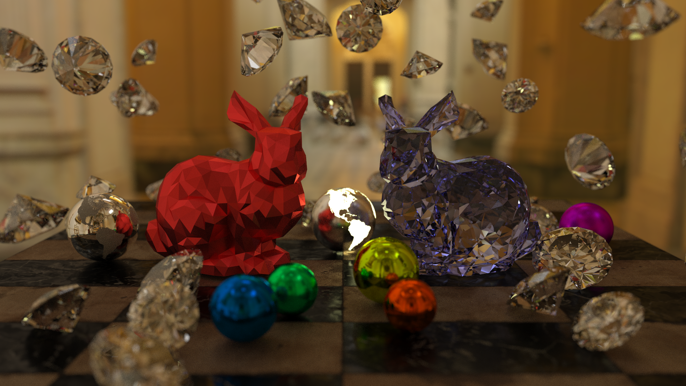
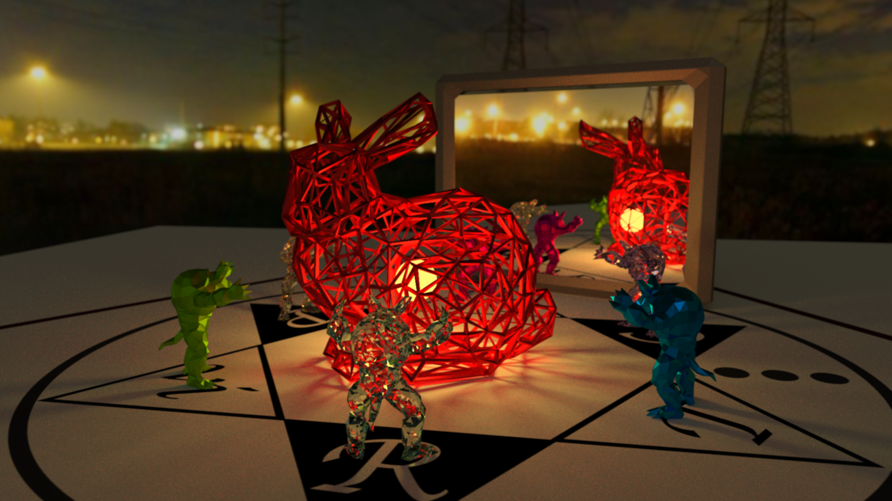

# hanamaru-renderer
レイトレ合宿に向けて開発したRustによるパストレーサーです。

- [レイトレ合宿5‽](https://sites.google.com/site/raytracingcamp5/)
- [レイトレ合宿6](https://sites.google.com/site/raytracingcamp6/)

## Results / 結果

### レイトレ合宿5‽

[](rtcamp5.png)


発表スライド
- [Hanamaru Renderer for レイトレ合宿5‽](https://speakerdeck.com/gam0022/hanamaru-renderer-for-reitorehe-su-5)

### レイトレ合宿6

[](rtcamp6_1000x4spp.png)

発表スライド
- [Hanamaru Renderer v2 for レイトレ合宿6](https://speakerdeck.com/gam0022/hanamaru-renderer-v2-for-reitorehe-su-6)

## Features / 機能

- BSDF
  - Diffuse
  - Specular
  - Refraction
  - GGX
  - Refraction with GGX Normal
- Geometry
  - Polygon Mesh
  - Sphere
  - AABB
- Texture Type
  - Albedo
  - Roughness
  - Emission
- Depth of Field（DoF）
- Image-Based Lighting（IBL）
  - Cube Map
- Parallel processing
- Debug Renderer
  - Fast lighting by directional light
  - Normal
  - Depth
  - Focal Plane
- Acceleration structure with BVH
- Next Event Estimation（NEE）
- Reinhard Tone Mapping
- Denoising（Bilateral Filter）

## Build & Run

[cargo](https://rustup.rs/)をインストールすればすぐにビルド+実行ができます。

```bash
git clone git@github.com:gam0022/hanamaru-renderer.git
cd hanamaru-renderer

# レイトレ合宿6のレギュレーションで実行
cargo run --release

# 制限時間を1047秒に設定し、60秒ごとに途中結果を出力しながら実行
cargo run --release -- -t 1047 -i 60

# 低解像度・サンプリング数を1で実行
cargo run --release -- -w 480 -h 270 -s 1

# デバッグモードで実行（被写界深度の焦点面を可視化）
cargo run --release -- -d

# ヘルプを表示
cargo run --release -- --help

Usage: hanamaru-renderer [options]

Options:
        --help          print this help menu
    -d, --debug         use debug mode
    -w, --width WIDTH   output resolution width
    -h, --height HEIGHT output resolution height
    -s, --sampling SAMPLING
                        sampling limit
    -t, --time TIME     time limit sec
    -i, --interval INTERVAL
                        report interval se
```
