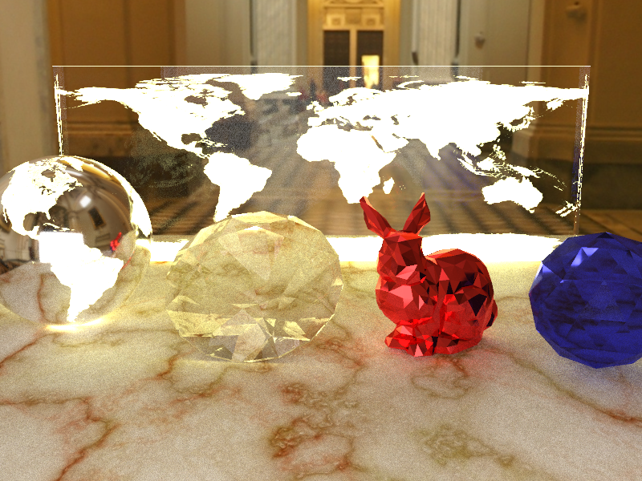

# hanamaru-renderer
[レイトレ合宿5‽](https://sites.google.com/site/raytracingcamp5/)に向けて開発したRustによるパストレーサーです。

[](test.png)

## Build & Run

[cargo](https://rustup.rs/)をインストールすればすぐにビルド＋実行ができます。

```bash
git clone git@github.com:gam0022/hanamaru-renderer.git
cd hanamaru-renderer
cargo run --release
```

## 発表スライド
[Hanamaru Renderer for レイトレ合宿5‽](https://speakerdeck.com/gam0022/hanamaru-renderer-for-reitorehe-su-5)
